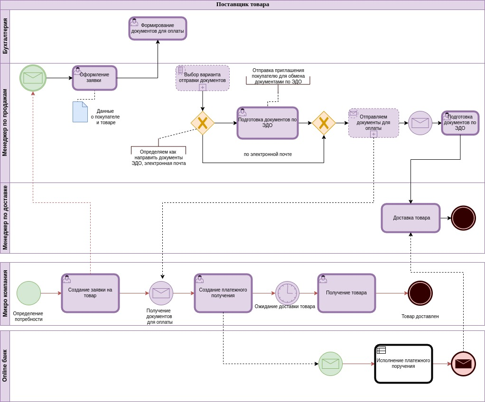

# Основы моделирования бизнес-процессов (семинары)

## Практическое задание. 

### Урок 5. Основные нотации описания бизнес-процессов Часть 1

Отрисуйте любой процесс в нотации BPMN

Можно использовать:

- Отправка посылки почтой России
- Заказ товара с маркетплейса
- Подготовка рекламной кампании
- Планирование ежемесячного бюджета
- Выдача справки сотруднику
- Любой другой свой процесс

